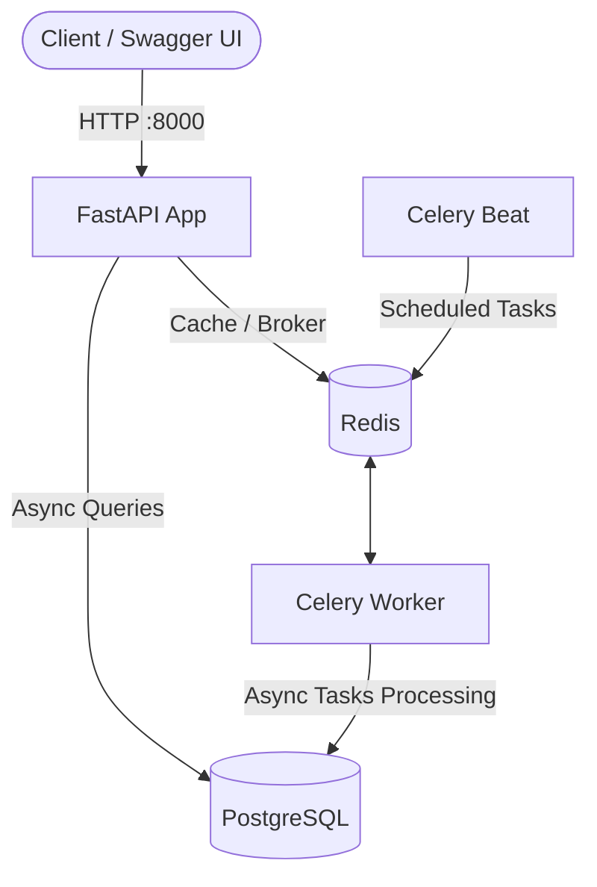

# EventSpace API 🚀

**EventSpace API** is a robust, production-ready RESTful web service designed for event management, user authentication, and ticket booking. Built with a fully asynchronous modern Python stack, the application is fully containerized using Docker and Docker Compose for seamless deployment.

---

## 🛠 Tech Stack

* **Web Framework:** FastAPI (with `uvloop` for high performance)
* **Database & ORM:** PostgreSQL 16, SQLAlchemy 2.0 (Async), Asyncpg
* **Caching & Message Broker:** Redis 7
* **Background Tasks & Scheduling:** Celery & Celery Beat
* **Database Migrations:** Alembic
* **Package Management:** Astral `uv`
* **Containerization:** Docker & Docker Compose

---

## 🏗 Architecture Overview

The system is structured as a modular monolith separated into distinct service roles to handle web traffic, background processing, scheduling, and data persistence efficiently.



---

## ⚙️ Prerequisites

Make sure you have the following installed on your local machine:
* [Docker](https://docs.docker.com/get-docker/) (Docker Desktop)
* [Docker Compose](https://docs.docker.com/compose/install/)

---

## 🚀 Quick Start (Running with Docker)

### 1. Configure Environment Variables
Create a `.env` file in the root directory of the project. You can use the template below:

```env
PROJECT_NAME="EventSpace API"
VERSION="1.0.0"
DEBUG=True

DATABASE_URL=postgresql+asyncpg://postgres:postgres_password@db:5432/postgres_password
SECRET_KEY=your_super_secret_key_here_change_in_production

REDIS_HOST=redis
REDIS_PORT=6379
REDIS_URL=redis://redis:6379/0
```

### 2. Build and Start Containers
Run the entire infrastructure (API, Database, Redis, Celery Worker, and Celery Beat) with a single command:

```bash
docker compose up -d --build
```

### 3. Run Database Migrations
Initialize and populate the database tables using Alembic inside the running container:

```bash
docker compose exec app alembic upgrade head
```

### 4. Access the Application
* **Swagger UI Documentation:** [http://localhost:8000/docs](http://localhost:8000/docs)
* **ReDoc Documentation:** [http://localhost:8000/redoc](http://localhost:8000/redoc)

---

## 💻 Useful Docker Commands

* **View live logs for the API:**
  ```bash
  docker compose logs -f app
  ```
* **View logs for Celery worker:**
  ```bash
  docker compose logs -f celery_worker
  ```
* **Stop all containers:**
  ```bash
  docker compose down
  ```
* **Stop and completely wipe containers + database volumes (clean reset):**
  ```bash
  docker compose down -v
  ```

---

## 🗄 Database Management
You can inspect and manage your PostgreSQL database externally:
* **Host:** `localhost`
* **Port:** `5432`
* **User:** `postgres`
* **Password:** `postgres_password`
* **Database:** `postgres_password`